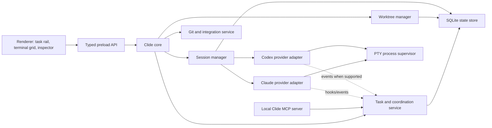

# Clide: multi-agent terminal IDE plan

Status: implementation complete; external signing/notarization credentials remain deployment-only  
Prepared: 2026-07-21  
Scope: turn Clide from a Claude-only terminal wrapper into a focused local IDE for
Claude Code and Codex, optimized for running 3–5 independent tickets in parallel.

## Implementation record — 2026-07-21

The plan is now represented in code. The implementation intentionally keeps PTYs as
the interactive surface while adding the complete local control plane:

- secure context-isolated/sandboxed Electron renderer and allowlisted preload API;
- upgraded Electron/rebuild dependencies with a zero-vulnerability npm audit;
- provider adapters for Claude and Codex, resume support, and automatic task-scoped
  Clide MCP configuration;
- transactional SQLite workspace/task/layout/session metadata with JSON migration;
- branch-owned worktree creation, `.worktreeinclude`, setup profiles, allocated dev
  ports, safe cleanup, and single-instance workspace routing;
- 1/2/4-pane flight-deck layouts, focus mode, branch ribbons, task rail, attention
  states, keyboard control, per-task terminal stacks, and on-demand inspector;
- durable dependencies/messages/findings/checks/artifacts/path claims, MCP tools
  shared by both providers, changed-path overlap detection, and queued user messages;
- Claude lifecycle hooks and Codex notification ingestion, with approval/waiting/
  failure/done attention plus child-agent visualization;
- hunk-level staging, cross-provider review worktrees, and disposable combined-test
  integration worktrees;
- checks recorded at the reviewed SHA, dry conflict preview, guarded explicit merge,
  and cleanup that preserves branches and blocks dirty/unique work by default;
- authenticated Unix-socket file-open/event shim, scoped/file-size-limited async file IPC,
  script-disabled HTML preview, setup doctor, packaging command, and automated unit
  plus Electron UI smoke tests, including five simultaneous mixed-provider worktrees;
- detached Screen-backed sessions and auxiliary shells that survive app process
  restarts, portable credential-free backup/restore, local metrics, signed release
  configuration, update channels, and previous-release rollback metadata.

Signing, notarization, and publishing are configured in the tag release workflow,
but a real public release still requires the owner's Apple credentials in GitHub
Actions secrets. Local packaging was verified with the available development
identity; notarization correctly remains skipped when credentials are absent.

## Final acceptance record — 2026-07-21

| Phase | Result | Verification |
|---|---|---|
| 0 · safety | Complete | sandboxed renderer, allowlisted IPC, zero high/critical audit findings, CI |
| 1 · providers/worktrees | Complete | five-worktree Electron test with a 3 Claude / 2 Codex mix and unique ports |
| 2 · flight deck | Complete | 1/2/4/focus layouts, task rail, tile ribbons, inspector, keyboard controls |
| 3 · coordination | Complete | SQLite + MCP + native events + dependencies + artifacts + claims + child agents |
| 4 · review/integration | Complete | hunk staging, conflict preview, checks-at-SHA, AI review and combined-test worktrees |
| 5 · durability/release | Complete | detached recovery, migration, backup, metrics, builder/updater/release workflow |

External publication is an operational step, not missing application code: add the
documented Apple secrets and push a version tag. No source changes were committed or
staged as part of this implementation.

## Executive decision

The product should be built around this invariant:

> One ticket owns one task, one agent session, one isolated Git worktree, and one
> explicit path back into the integration branch.

The first major feature should therefore **not** be ordinary branch switching.
Clide already lets a session switch the branch of its working directory, but two
sessions opened on the same directory still see and mutate the same files. A branch
checkout in either session changes the repository underneath both agents. The safe
primitive is a Git worktree per active ticket.

The recommended product shape is:

1. A provider-neutral session core that can launch Claude Code or Codex.
2. A Clide-owned worktree manager that gives every ticket an isolated checkout.
3. A 1/2/4-pane terminal grid with a compact status header per agent.
4. A mission-control layer for tasks, attention, changes, tests, and integration.
5. A local coordination service, exposed to both providers through MCP, for task
   state, findings, review requests, and cross-agent messages.
6. A guarded integration queue that detects overlap and conflicts but never merges,
   deletes, commits, or pushes without explicit user intent.

This keeps the terminal as the source of truth while adding the structure needed to
operate several agents confidently.

## North-star workflow

A user pastes or creates five tickets. For each ticket, Clide asks for:

- provider: Claude Code or Codex;
- repository and clean base ref;
- task/branch name;
- setup profile and permission profile;
- optional dependencies on other tickets.

Clide creates five worktrees, runs their setup commands, and opens the sessions in a
grid. The user can focus one agent or monitor all of them. Every tile answers, at a
glance:

- What ticket is this?
- Which provider, repo, worktree, and branch does it own?
- Is it running, waiting for input, asking approval, blocked, or finished?
- What files changed, and do those files overlap another ticket?
- Did its required checks pass?
- Is it ready to review or integrate?

Agents can publish findings and dependency updates through Clide. When work is done,
the user reviews a branch/worktree diff and deliberately chooses whether to keep,
rebase, merge, open a PR, or archive it.

## What exists today

Clide 0.1.0 is a compact Electron application with a useful foundation:

- `node-pty` runs an interactive Claude Code terminal.
- Multiple Claude sessions can exist as top tabs.
- Each session has its own xterm instance, viewer tabs, file tree, Git panel, and
  persisted resume ID.
- A local `open` shim lets an agent reveal a file in Clide.
- Claude history is discovered from `~/.claude/projects/*.jsonl`.
- The UI shows a best-effort model, context usage, repo, and current branch.
- The right panel can render text, Markdown, code, HTML, images, and diffs.
- The bundled `agentic-dev-os` contains thoughtful ticket-impact, review, testing,
  wiki, and wrap-up workflows.

These are real strengths. The application does not need to become VS Code. Its
advantage can be that it is a **control surface for coding agents with a terminal
escape hatch**, rather than a general-purpose editor with an AI sidebar.

## Audit findings

### Architecture and product gaps

| Finding | Evidence in the current code | Consequence |
|---|---|---|
| The runtime is Claude-specific. | `main.js` hardcodes `claude`, `~/.claude/projects`, Claude JSONL parsing, and a Claude model window. | Codex cannot be added cleanly without first introducing a provider interface. |
| Sessions share the caller's checkout. | `session-start` launches every PTY with the supplied `cwd`; branch actions run `git checkout` in that same directory. | Two sessions for one repo can silently disrupt each other. |
| Only one terminal is visible. | Every terminal is absolutely positioned and `switchSession` hides all but the active one. | The current tab model cannot provide the requested 2×2 view. |
| State is inferred from transcripts and terminal bells. | Status polls Claude JSONL; “waiting” notifications rely on `term.onBell`. | Running, approval, blocked, idle, and done states are unreliable. |
| Session persistence is renderer-local. | `localStorage` stores open sessions and viewer tabs. PTYs die with the Electron process. | A crash or app restart can resume history, but cannot preserve active processes or in-flight work. |
| Main and renderer files are monolithic. | `main.js` is 386 lines; `renderer/renderer.js` is 989 lines and owns nearly every UI concern. | Provider, grid, worktree, and coordination features will become difficult to test and change safely. |
| Filesystem work blocks the main process. | Tree walking, file reads, transcript reads, and several Git lookups use synchronous APIs. | Large repos or large files can freeze the entire UI. |
| The Git UX can stage more than expected. | Commit automatically stages everything when nothing is staged. | A convenience action can commit unreviewed files. |
| There is no automated verification. | No test, lint, typecheck, or CI script exists. | Session and Git regressions will be hard to detect during the redesign. |
| Distribution is incomplete. | Packager is installed, but there is no release script, signing/notarization flow, updater, or CI release pipeline. | Team installation and safe upgrades remain manual. |

### Security findings that should precede feature work

The current Electron renderer has `nodeIntegration: true`,
`contextIsolation: false`, `sandbox: false`, and `webviewTag: true`. It also renders
repository-controlled content and opens file/URL targets. This combination turns a
renderer injection or unsafe navigation into local code-execution risk.

Other material risks:

- IPC handlers can read and overwrite arbitrary paths supplied by the renderer; they
  are not constrained to the active session's worktree.
- The local HTTP shim listens on a predictable port without a session secret and
  accepts file-open requests from any local caller.
- Resume IDs are interpolated into a shell command instead of passed as an argument
  array.
- File reads have no size cap, and image reads base64-encode the whole file.
- Multiple Clide processes can contend for the same fixed shim port.
- HTML preview and external navigation need explicit origin, popup, permission, and
  download policies.

The current `npm audit` result reports **7 known vulnerabilities: 1 critical and 6
high**, including the direct Electron 32 dependency and the `@electron/rebuild`
toolchain. The remediation should upgrade Electron and rebuild tooling deliberately,
then verify `node-pty` compatibility; it should not use an unreviewed forced audit
fix.

### UX findings

The screenshot and CSS show a familiar three-column IDE, but the most valuable area
is dominated by one terminal while session identity and attention state are thin.
The right file viewer is always allocated 480 px even when no file is open, which
makes the central workspace feel empty and reduces room for parallel terminals.

The UI needs to shift from “editor with a terminal” to “agent flight deck”:

- agent tasks should be the primary objects;
- terminal panes should be arrangeable, not just tabbed;
- file/diff/test detail should appear on demand in an inspector;
- waiting and approval states should be more visually prominent than provider/model
  trivia;
- branch/worktree identity must remain visible on every pane, not only in a global
  status bar;
- interactive spans need to become accessible buttons with keyboard focus and
  descriptive labels.

## Product principles

1. **Isolation before orchestration.** Never parallelize writes into one checkout.
2. **Terminal first, structured when available.** Provider TUIs remain usable even
   if an experimental API changes.
3. **Provider parity at the core, provider advantages at the edge.** Worktrees,
   tasks, diffs, messages, and integration behave the same; native Claude teams and
   Codex subagents remain available as provider-specific enhancements.
4. **Attention, not activity.** The UI should tell the user where a decision is
   needed, not overwhelm them with token-by-token dashboards.
5. **Artifacts beat chatter.** Tasks, diffs, findings, test results, and review
   requests are more reliable coordination objects than free-form agent chat.
6. **No invisible Git.** Creating, checking out, committing, rebasing, merging,
   deleting, and pushing must be named actions with a preview and clear target.
7. **Local by default.** Source, transcripts, task state, and credentials stay local
   unless the user explicitly connects or publishes to an external service.

## Target architecture



### Main-process modules

Move toward these bounded modules rather than extending `main.js`:

```text
src/main/
  app.js
  ipc/
    register-handlers.js
    schemas.js
  sessions/
    session-manager.js
    process-supervisor.js
    provider-adapter.js
    claude-provider.js
    codex-provider.js
  worktrees/
    worktree-manager.js
    setup-runner.js
    port-allocator.js
  git/
    git-service.js
    integration-service.js
    overlap-detector.js
  coordination/
    task-service.js
    message-service.js
    mcp-server.js
  files/
    file-service.js
  store/
    database.js
src/preload/
  index.js
src/renderer/
  app/
  components/
  state/
  styles/
```

The refactor does not require React. A small component/state layer in plain
JavaScript is acceptable for the first slice. If the grid and task board create too
much manual DOM synchronization, adopt a lightweight typed renderer framework in a
separate decision rather than mixing a framework migration with worktree logic.

## Core domain model

Clide needs durable IDs independent of terminal processes or provider transcript
filenames.

```text
Workspace
  id, name, repositories[], defaultLayout, worktreeRoot

Repository
  id, canonicalPath, gitCommonDir, defaultBaseRef, setupProfileId

Task
  id, externalKey?, title, prompt, state, dependencies[], ownerSessionId?

Worktree
  id, repositoryId, path, baseRef, branch?, headSha, lifecycleState

Session
  id, taskId, provider, providerSessionId?, worktreeId, state,
  permissionProfile, startedAt, lastAttentionAt

Artifact
  id, taskId, sessionId, kind, title, body/path, createdAt

Message
  id, fromSessionId?, toSessionId?, taskId?, type, body, state

CheckRun
  id, worktreeId, command, state, exitCode, startedAt, finishedAt
```

SQLite is recommended for this coordination metadata because it supports atomic task
claims, message delivery, crash recovery, and queries across sessions. Agent
transcripts and source files remain in their native provider/repository locations.

## Provider strategy

### Stable baseline: PTY adapters

Version 1 should continue to run the official interactive CLIs through PTYs. The
adapter owns command discovery, arguments, resume behavior, environment, and
capabilities:

```js
class ProviderAdapter {
  detect()
  launch({ cwd, prompt, resumeId, name, env, cols, rows })
  resume({ cwd, providerSessionId })
  listHistory(repository)
  interrupt(session)
  normalizeStatus(rawEvent)
  capabilities()
}
```

- Claude adapter: `claude`, named sessions, resume IDs, transcript discovery,
  optional worktree and hook capabilities.
- Codex adapter: `codex`, `codex resume`, Codex history/session discovery, and Codex
  configuration detection.
- Process launching must use executable plus argument arrays. A login-shell PATH can
  be resolved once, but user values must not be interpolated into shell source.

This gets two Claude, two Codex, or any other mix into one grid without depending on
unstable protocols.

### Structured adapters: progressive enhancement

Claude's Agent SDK recommends streaming input for long-lived interactive sessions;
it exposes messages, tool use, interruptions, permissions, hooks, and session state.
It is a strong later adapter for a native conversation/activity view. However,
programmatic Agent SDK usage has different plan/credit considerations from ordinary
interactive Claude usage, so Clide should not silently replace the user's terminal
subscription workflow.

Codex exposes an app-server protocol with stdio, Unix socket, and WebSocket
transports, but the current official manual labels it experimental. Build its client
behind a capability flag after the PTY adapter works. Do not make the first release
depend on an unstable protocol.

The terminal must stay available in both structured modes for slash commands,
provider-native agent views, and recovery.

### Provider capability matrix in the UI

The new-session dialog should detect and disclose capabilities rather than assuming
every provider supports the same features:

| Capability | Claude Code | Codex | Clide behavior |
|---|---|---|---|
| Interactive TUI | Yes | Yes | Required baseline. |
| Resume | Yes | Yes | Normalize behind adapter. |
| Native worktrees | Yes | Desktop app also supports worktrees | Clide owns worktrees for consistent mixed-provider behavior. |
| Native delegated agents | Subagents and experimental agent teams | Subagents/multi-agent workflows | Display as nested activity; do not replace with fake peer sessions. |
| Structured local events | Hooks and Agent SDK | App server is currently experimental | Use when available; fall back to process and Clide-MCP status. |
| Native peer messaging | Claude agent-team teammates | Parent-orchestrated subagents | Use only inside that provider session. Cross-provider coordination uses Clide. |

## Worktree design

### Why Clide should own worktrees

Both Claude Code and the Codex desktop experience support worktree isolation, which
validates the model. Clide should still create the worktrees itself because mixed
Claude/Codex sessions need one lifecycle, location, setup process, conflict model,
and cleanup policy.

Recommended default location:

```text
~/.clide/worktrees/<repository-id>/<task-slug>/
```

Make the root configurable. Keeping managed worktrees outside the checkout prevents
them from polluting file search and untracked-file lists.

### Creation flow

1. Resolve the repository by its Git common directory, not just by folder name.
2. Fetch only when the user/profile permits it.
3. Select a base:
   - clean `origin/HEAD` by default;
   - current local `HEAD` when explicitly requested;
   - a selected commit/branch/PR for advanced cases.
4. Reject a branch already owned by another worktree.
5. Create a unique task branch or a detached exploratory worktree.
6. Copy only explicitly allowed ignored files using `.worktreeinclude` semantics.
7. Run the repository setup profile.
8. Start the provider with its `cwd` fixed to the worktree.
9. Persist the mapping before launching the agent so a crash can recover it.

Dirty changes in the main checkout must never be copied implicitly. Offer a separate
“include current uncommitted changes” action with a patch preview.

### Setup profiles

Worktrees are fast to create but are not always ready to run. Each repository should
support a checked-in `.clide/project.json` or local workspace profile containing:

- setup command;
- maintenance command;
- required checks;
- dev-server command;
- environment-file include patterns;
- port variables and allocation range;
- optional cache/store paths;
- ready-signal pattern and timeout.

Clide should allocate distinct ports per worktree so five agents do not all try to
run the same app on port 3000. Show allocated URLs on the task tile.

### Cleanup states

- **Disposable:** clean, no unique commits; safe to remove after confirmation.
- **Keep:** changes or commits exist; preserve and pin.
- **Integrated:** commit is reachable from the chosen integration branch; offer
  archive/removal.
- **Orphaned:** process/session missing but worktree remains; offer recovery.
- **Broken:** Git metadata/path mismatch; diagnose before any removal.

Never use forced worktree removal as the default. Preview untracked files and unique
commits before cleanup.

## Per-task terminal stacks

Every task/session owns a terminal stack, not just one agent terminal. The first tab
is the Claude or Codex terminal; the user can add ordinary login shells in the same
worktree for dev servers, tests, logs, database consoles, or any other command.

```text
Task PROJ-101 · worktree/proj-101
┌ Agent · Claude ─┬ zsh · dev ─┬ zsh · tests ─┬ + ┐
│                  selected terminal output          │
└─────────────────────────────────────────────────────┘
```

Terminal requirements:

- `+` creates a normal shell with the task worktree as its exact `cwd`.
- A task can have any practical number of terminals; the strip scrolls when full.
- The agent terminal is visually distinct and remains the source for provider
  status, context, approvals, and attention notifications.
- Auxiliary terminals can be renamed, restarted, reordered, and closed without
  affecting the agent or sibling shells.
- Closing a task closes all owned terminals after warning about active processes.
- File/path drops and terminal keyboard input always target the selected terminal.
- Layout state and terminal names persist, but commands are never replayed
  automatically after restart. Restored auxiliary tabs open as clean shells.
- Each worktree's setup profile supplies a distinct environment/port allocation so
  five tasks can run five copies of the project at the same time without all trying
  to bind the same port.
- Dev-server readiness, exit state, and allocated URLs appear in the task inspector;
  raw terminal output remains available at all times.

The terminal stack is independent of the future 2×2 task grid: a grid cell selects
one task, and that cell can switch among the task's agent/dev/test terminal tabs.
This avoids treating every dev server as another agent while keeping all runtime
activity attached to the branch that owns it.

## Cross-agent coordination

### Use native teams inside a session

Claude agent teams already provide a lead, teammates, shared task list, and direct
mailboxes, but they are experimental and have limitations around resume, shutdown,
and one-team-per-session. Codex supports visible subagent workflows coordinated by
the parent thread. Clide should visualize these native child agents when provider
events expose them, not try to impersonate them.

### Use a Clide coordination bus across top-level sessions

For a Claude session and a Codex session to cooperate, add a local MCP server with a
small, provider-neutral tool set:

```text
clide_get_task
clide_list_tasks
clide_claim_path_scope
clide_publish_finding
clide_request_review
clide_send_message
clide_read_inbox
clide_report_status
clide_report_check
clide_complete_task
```

Each launched process receives `CLIDE_WORKSPACE_ID`, `CLIDE_TASK_ID`, and
`CLIDE_SESSION_ID`. Clide injects the MCP configuration only for that process; it
does not rewrite the user's global Claude or Codex configuration.

The task prompt and repository instructions should define a short protocol:

- publish a status at meaningful phase boundaries;
- announce the file/path scope before editing;
- publish interface or schema decisions that affect another task;
- request a review using a diff artifact;
- read the inbox before marking the task complete;
- do not wait indefinitely for another task without surfacing the dependency.

### Do not rely on terminal keystroke injection

Sending text into a busy TUI can corrupt an input field, answer the wrong approval,
or interrupt a tool. In the PTY baseline, messages should be queued and shown in the
tile. Deliver them to an agent only when the user sends them or when Clide has a
provider-confirmed idle/input state. Structured provider adapters can later support
safe mid-session steering.

### Conflict prevention

Hard file locks are too restrictive. Use advisory ownership and real Git evidence:

- task creation can declare expected directories/files;
- agents can claim/update their path scope through MCP;
- file watchers and `git status` update the actual changed-path set;
- the mission-control view highlights pairwise overlap immediately;
- schema, migration, lockfile, generated-client, and shared-config paths receive a
  higher conflict severity;
- completion runs a dry merge/rebase conflict check against the current integration
  head without mutating either worktree.

If two tasks overlap, Clide should suggest dependency ordering or a review—not
pretend that the branches are conflict-free.

## UI redesign

### Design direction

Subject: a local operations console for a developer supervising 3–5 coding agents.  
Single job: reveal which agent needs attention and make the next safe action obvious.

The visual metaphor is a **branch flight deck**, not a generic chat dashboard. Each
agent tile carries a persistent branch ribbon connecting provider, ticket, worktree,
changes, checks, and integration state.

Suggested tokens:

- `Graphite` `#15171A`: terminal and primary canvas;
- `Workbench` `#20242A`: rails and inspector surfaces;
- `Steel` `#313741`: borders and inactive controls;
- `Signal blue` `#5B8CFF`: selection and Codex identity;
- `Claude amber` `#D99A5B`: Claude identity, used sparingly;
- `Ready green` `#62B879`, `Attention gold` `#D7B55B`, `Blocked red` `#E06C68`:
  semantic state only.

Use the macOS system UI font for controls and JetBrains Mono/SF Mono for terminals,
branches, paths, and data. Provider color is identity; status color is state. Never
use one color for both.

### Primary layout

```text
┌ Workspace / base / layout / attention inbox / integrate queue ┐
├──────────────┬───────────────────────────────┬─────────────────┤
│ Tasks        │ Agent A          │ Agent B    │ Inspector       │
│ ● PROJ-101   │ Claude · running │ Codex · ⚠  │ changes         │
│ ◐ PROJ-102   │ worktree/101     │ worktree/2 │ diff / files    │
│ ○ PROJ-103   ├──────────────────┼────────────┤ checks / msgs   │
│              │ Agent C          │ Agent D    │ integration     │
│ Worktrees    │ Claude · waiting │ Codex done │                 │
│ Changes      │ worktree/103     │ worktree/4 │                 │
└──────────────┴──────────────────┴────────────┴─────────────────┘
```

Layout presets:

- single focus;
- two columns;
- two rows;
- 2×2 grid;
- three plus one large focus pane;
- auto layout based on window width.

At narrower sizes, collapse the task rail and inspector into drawers. The terminal
grid keeps priority. Persist layout per workspace, not globally.

### Agent tile header

Every tile header should show:

- provider icon/name and optional model;
- ticket key and short title;
- state badge: starting, running, waiting, approval, blocked, done, exited;
- repo, worktree, and branch;
- changed-file count and overlap warning;
- check state;
- elapsed time and optional usage/cost when reliable;
- focus, message, restart/resume, and close actions.

Use one animated cue only: a restrained progress trace in the branch ribbon while an
agent is actively running. Respect reduced-motion preferences.

### Task rail and inspector

The left rail switches between Tasks, Worktrees, and Changes. It is not a full file
explorer by default. Selecting a tile or task populates the right inspector with:

- attention/request details;
- messages and published findings;
- changed files and diff;
- file viewer/editor;
- check runs and logs;
- Git/integration actions.

This reuses today's useful viewers without reserving a permanent empty column. A
keyboard shortcut should toggle the inspector over the grid.

### Mission-control features

- “New task” and “Import tickets” create task cards before sessions.
- Drag a task onto an empty pane to launch it.
- Drag a running tile to rearrange the grid, never to change its worktree.
- An attention inbox groups approvals, questions, conflicts, failures, and completed
  work; it does not show ordinary streaming activity.
- `Cmd+1…9` focuses agents; `Cmd+Shift+1…9` sends a queued message to an idle agent;
  `Cmd+\` toggles focus/grid; `Cmd+I` toggles the inspector.
- Broadcast is limited to non-destructive context updates and always previews the
  recipient list.

## Integration queue

Finished does not mean integrated. Add a review flow with these stages:

1. **Agent done:** session reports completion.
2. **Checks:** run the configured required checks in that worktree.
3. **Review:** inspect changed files, commits, findings, and generated artifacts.
4. **Conflict preview:** compare against the latest selected integration branch.
5. **Decision:** keep, request changes, rebase/update, create PR, merge, or archive.
6. **Cleanup:** only after reachability and dirty-state checks.

The queue should serialize integration even if implementation was parallel. After
one branch integrates, recompute conflicts for the others. This is the point where
parallel speed is converted into a coherent main branch.

Useful later actions:

- ask the same agent to fix review findings;
- ask the other provider to perform an independent read-only review;
- generate a PR summary from task, diff, checks, and decisions;
- compare two candidate implementations before choosing one;
- create a temporary “integration worktree” for combined end-to-end testing.

## Agentic-dev-os and repository setup

The bundled workflow is valuable but currently Claude-only in its packaging:

- installer targets `~/.claude/skills`;
- workspace template provides `CLAUDE.md` and `.claude/` hooks;
- plugin manifest is `.claude-plugin`;
- the Clide welcome and README describe only Claude.

Make the workflow provider-neutral before presenting it as a Clide-wide OS:

1. Keep one canonical skill source under `agentic-dev-os/skills`.
2. Add a Codex installation path using repo/user `.agents/skills` or package a Codex
   plugin when distribution needs it.
3. Generate or maintain paired `CLAUDE.md` and `AGENTS.md` entry points from shared
   operating rules, with provider-specific commands in small sections.
4. Replace “subagent-driven everywhere” with capability-aware language: native
   Claude teammates, Claude subagents, or Codex subagents only when explicitly
   requested and useful.
5. Add a setup doctor that reports Claude CLI, Codex CLI, Git, node-pty rebuild,
   skills, MCP, hooks, and worktree readiness without silently changing user config.
6. Let onboarding install per provider, per repo or user scope, and show exactly which
   files will be created.

This repository now has a root `AGENTS.md` for future Codex work. No global Codex or
Claude configuration should be installed as part of the product redesign without a
separate, visible user choice.

## Security and reliability foundation

Complete these before exposing four simultaneous privileged agents:

1. Upgrade Electron, `@electron/rebuild`, and affected transitive dependencies;
   rebuild and test `node-pty` on supported macOS versions.
2. Enable `contextIsolation`, disable renderer Node integration, expose a minimal
   `contextBridge` API, and enable renderer sandboxing where compatible.
3. Replace broad IPC objects with validated schemas and typed request/response
   contracts.
4. Associate every file/Git request with a session ID; resolve and verify the path is
   inside its worktree or an explicit user-approved external path.
5. Remove the privileged `<webview>` path. Render HTML in a script-disabled sandbox
   or open it in the user's browser; define navigation, popup, permission, and
   download policies.
6. Sanitize rendered Markdown and prevent renderer navigation from repository links;
   route external URLs through a validated open-external action.
7. Replace the fixed unauthenticated HTTP shim with a random per-app secret on a
   random loopback port or a Unix socket. Include session identity and enforce body
   limits.
8. Pass CLI and Git arguments as arrays. Validate branch/worktree names and never
   embed transcript IDs in shell source.
9. Add file-size limits, streaming reads, cancellation, and async filesystem/Git
   operations.
10. Add a single-instance broker so `clide <path>` opens a workspace in the existing
    app instead of creating a second port-owning process.
11. Persist state in the main process. Flush worktree/session metadata transactionally
    and reconcile it with Git and live processes at startup.
12. Add crash reporting that is local and opt-in for external upload; never include
    transcript contents or source by default.

## Testing strategy

### Unit tests

- provider command/argument construction;
- Claude and Codex history normalization;
- path containment and IPC schema validation;
- worktree state classification;
- branch-name validation;
- overlap severity;
- task dependency and message state transitions;
- state migration and crash reconciliation.

### Integration tests

Use temporary Git repositories to verify:

- five branches/worktrees can be created from one base;
- each PTY receives only its worktree path and identity;
- the same branch cannot be assigned twice;
- dirty main changes are not copied implicitly;
- `.worktreeinclude` behavior;
- setup failure and retry;
- conflict previews after another task integrates;
- safe cleanup with dirty files, untracked files, and unique commits;
- restart recovery.

### Electron end-to-end tests

Use mock provider executables for deterministic tests of:

- mixed 2×2 terminal layout and resizing;
- waiting/approval/failure/done attention states;
- queued message delivery;
- diff inspector and overlap warnings;
- keyboard navigation and screen-reader labels;
- app relaunch with task/worktree restoration.

Run real Claude/Codex smoke tests separately because authentication, rate limits,
models, and provider output are not deterministic CI dependencies.

## Delivery plan

### Phase 0 — make the foundation safe and testable

Goal: reduce security and regression risk before expanding concurrency.

Deliverables:

- dependency/Electron upgrade;
- secure preload boundary and path-scoped IPC;
- main-process module extraction;
- unit test runner, formatter/linter, and macOS CI;
- single-instance app/shim transport fix;
- remove implicit “stage all then commit” behavior.

Acceptance:

- `npm audit` has no unresolved critical/high issue without a documented exception;
- renderer has no direct Node access;
- an arbitrary renderer path cannot read/write outside its session root;
- syntax, unit, and packaged-app smoke checks run in CI.

### Phase 1 — provider-neutral sessions and worktrees

Goal: safely run Claude and Codex on different branches of the same repo.

Deliverables:

- provider adapter contract;
- Claude and Codex PTY adapters with detection and resume;
- workspace/repository/task/worktree/session store;
- Clide-owned worktree create, recover, keep, and cleanup flows;
- new-task dialog with provider, base, branch, setup, and permission choices;
- setup profiles and `.worktreeinclude` support;
- per-worktree port allocation.

Acceptance:

- create five tasks from one repository and launch any Claude/Codex mix;
- all five sessions have distinct working directories and branches;
- editing or switching state in one task does not change another task's files;
- app restart reconstructs every task/worktree and can resume its provider session;
- unsafe cleanup and duplicate branch ownership are blocked.

### Phase 2 — terminal grid and attention UX

Goal: supervise four sessions without tab switching.

Deliverables:

- 1/2/4-pane layout engine and focus mode;
- task/worktree rail;
- per-tile identity/status ribbon;
- collapsible inspector reusing file, Markdown, image, HTML-safe-preview, and diff
  views;
- attention inbox and desktop notifications;
- keyboard and accessibility pass;
- persisted per-workspace layouts.

Acceptance:

- a 2×2 grid remains readable and each PTY resizes correctly;
- a user can identify provider, ticket, worktree, branch, state, changes, and checks
  without focusing a tile;
- approval/waiting/failed states are visible within one second of a reliable event;
- the full workflow is keyboard operable.

### Phase 3 — coordination and conflict awareness

Goal: let independent agents exchange durable project facts without sharing a
checkout.

Deliverables:

- local Clide MCP server and scoped per-process config;
- task dependencies, artifacts, findings, messages, review requests, and check
  reports;
- advisory path claims and live changed-path overlap detection;
- provider hooks/events where stable;
- native child-agent visualization where available;
- safe queued-message flow for PTY sessions.

Acceptance:

- Claude and Codex can publish/read the same task metadata through MCP;
- a schema decision from one task appears as attention for a dependent task;
- overlapping changed files are flagged before integration;
- no message is injected into a busy or approval-focused TUI without an explicit,
  safe delivery state.

### Phase 4 — review and integration queue

Goal: turn parallel branches into reviewed, tested, ordered deliverables.

Deliverables:

- aggregated worktree changes and check runs;
- diff review with per-file/hunk staging after explicit opt-in;
- dry conflict/rebase preview;
- serialized integration queue;
- cross-provider review task;
- optional PR creation adapter;
- integration worktree for combined testing.

Acceptance:

- integration never mutates a branch before a preview and confirmation;
- after integrating one branch, remaining conflict previews refresh;
- unique commits and untracked work cannot be lost during cleanup;
- required checks and their exact commit SHA are visible in the decision view.

### Phase 5 — durable background work and distribution

Goal: make Clide reliable for daily team use.

Deliverables:

- persistent process supervisor or attachable terminal backend so sessions can
  survive renderer/window restarts;
- signed and notarized macOS builds;
- auto-update with release channels and rollback;
- setup doctor and migration tooling;
- workspace export/import without credentials or transcript contents;
- performance telemetry that is local by default and opt-in for sharing.

Acceptance:

- closing/reopening the window does not lose active supervised work;
- upgrades preserve tasks, layouts, worktrees, and provider resume IDs;
- a new machine can install and diagnose both CLIs without manual source checkout.

## Recommended pull-request sequence

Keep each change reviewable and avoid a single rewrite:

1. Add tests, dependency upgrades, and secure preload/IPC boundary.
2. Extract Git, file, transcript, and PTY services with no intentional UI change.
3. Introduce the provider adapter and Codex terminal sessions.
4. Add persistent workspace/task/session schema and migrations.
5. Implement worktree lifecycle and setup profiles behind the existing tab UI.
6. Replace terminal tab visibility with the grid layout engine.
7. Move the file/Git viewer into the task inspector and add attention states.
8. Add Clide MCP coordination and overlap detection.
9. Add the integration queue and combined verification worktree.
10. Add process persistence and signed distribution.

Each PR should include a migration/rollback note and preserve the terminal-only path.

## What not to build first

- A custom code editor or language server: Clide's differentiation is supervising
  agents, not replacing mature editors.
- A home-grown agent runtime: use the official Claude and Codex runtimes.
- Automatic AI task splitting before worktree isolation and status are reliable.
- Automatic merges or conflict resolution without a review checkpoint.
- Cross-provider chat based on typing into terminal panes.
- Cloud sync of transcripts/source by default.
- Jira/Linear/Slack integrations before the local task model is stable; add those as
  adapters later.
- Windows/Linux support in the same milestone as the architecture rewrite. Keep
  platform boundaries clean so this can follow later.

## Success metrics

Measure whether Clide improves delivery rather than just increasing agent count:

- median time from ticket paste to isolated, ready session;
- number of simultaneously active tasks without checkout collision;
- percentage of agent attention events noticed before timeout;
- setup success rate for fresh worktrees;
- overlap/conflict warnings raised before integration;
- required-check pass rate at the reviewed SHA;
- app/session recovery success after restart;
- time from first task completion to all selected tasks integrated;
- user interventions caused by Clide ambiguity or unsafe Git behavior;
- token/cost per integrated ticket when provider data is available.

## Decisions implemented

The implementation selected these defaults:

1. **Worktree ownership:** Clide-managed worktrees for both providers (recommended)
   versus using each provider's native worktree feature.
2. **Primary UI:** task rail + 2×2 grid + on-demand inspector (recommended) versus
   retaining permanent file and viewer columns.
3. **Persistence:** SQLite coordination store (recommended) versus versioned JSON.
4. **Structured runtimes:** PTY-first with optional structured adapters
   (recommended) versus immediately replacing the TUI with SDK/app-server UIs.
5. **Integration authority:** review/preview in Clide, explicit user merge/push
   (recommended) versus allowing agents to publish automatically.
6. **Delivery scope:** all phases, with external release credentials supplied only
   by the repository owner at publishing time.

## Research basis

- OpenAI's current Codex manual documents local multi-agent workflows, provider
  subagent visibility, `AGENTS.md`, stable interactive/resume commands, and
  worktree-based parallel chats. The manual also identifies `codex app-server` as
  experimental: [Codex documentation](https://developers.openai.com/codex/).
- Codex worktrees use separate checkouts so chats can work on parallel branches,
  while Git still permits a branch to be checked out in only one worktree:
  [Codex worktrees](https://developers.openai.com/codex/app/worktrees/).
- Claude Code officially supports `--worktree`, `.worktreeinclude`, resume into a
  worktree, and manual Git worktrees:
  [Claude Code worktrees](https://code.claude.com/docs/en/worktrees).
- Claude agent teams provide a lead, separate teammate contexts, direct messaging,
  and a shared task list, but remain experimental and document resume/shutdown/task
  limitations:
  [Claude Code agent teams](https://code.claude.com/docs/en/agent-teams).
- Claude hooks expose session, tool, permission, subagent, task, and lifecycle events
  suitable for observability and policy:
  [Claude Code hooks](https://code.claude.com/docs/en/hooks) and
  [Agent SDK hooks](https://code.claude.com/docs/en/agent-sdk/hooks).
- Claude's Agent SDK recommends streaming input for persistent interactive sessions:
  [Agent SDK streaming input](https://code.claude.com/docs/en/agent-sdk/streaming-vs-single-mode).
